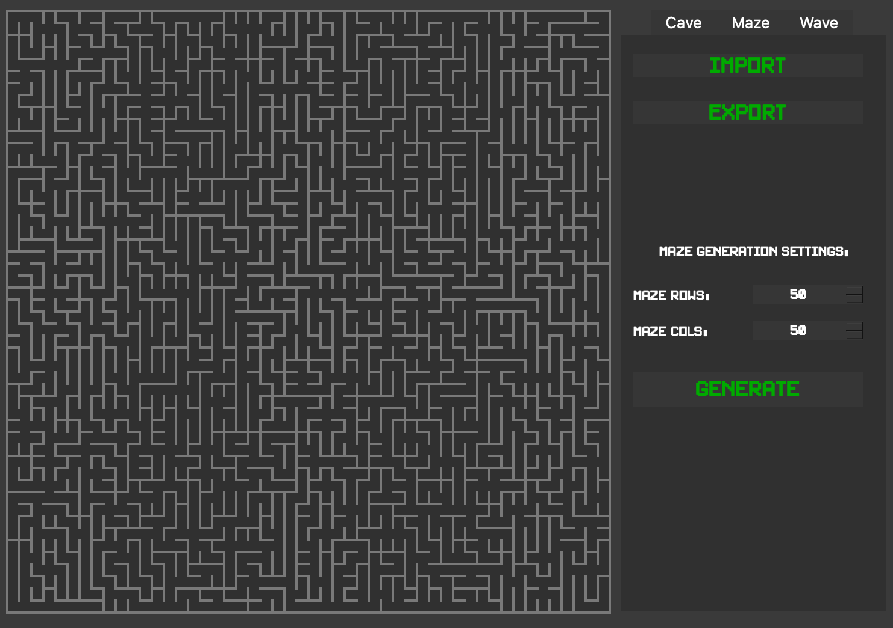
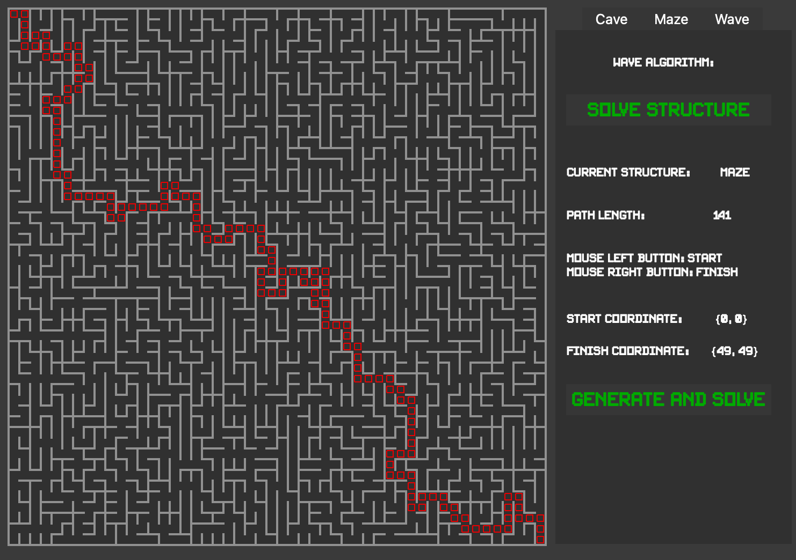
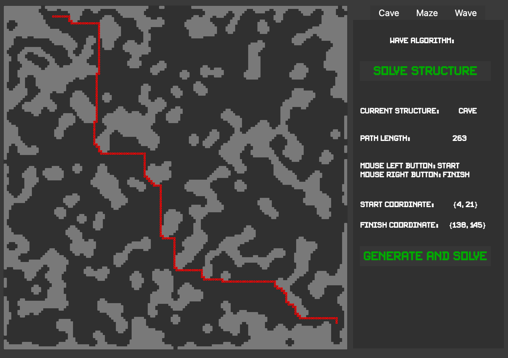
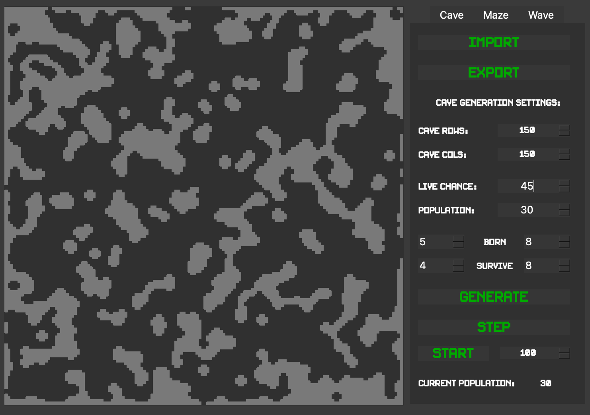

# MazeAndCaveSimulator Project

## Developers
- tonitaga

## How to install project

- make install 
- make open

## Tests

- make tests
- make leaks

## Implementation of the Maze project

- Program is developed in C++17 standart
- Program scene field is 500 x 500 pixels and the wall thickness in maze is 2 pixels
- GUI implementation based on Qt
- Program have a button of load and export (generated) files
- Code writing style is based on Google Style
- When writing code it is necessary to follow the Google style

## Generation of a perfect maze

- Program have a button of generation perfect maze using Eyler Algorithm
- The max size of generating labirint is 75 x 75

## Solving the maze and cave

- Program can solve any maze and cave structures in scene
- Solving algorithm is based on Wave Algorithm
- In tab Wave you can see the main info of Wave Algorithm

## Cave Generation

- Cave generation is based on cellular automaton
- Have soft settings of generation
- Max size of cave is 150 x 150
- There are timer in tab where you can simulate the live of cave

